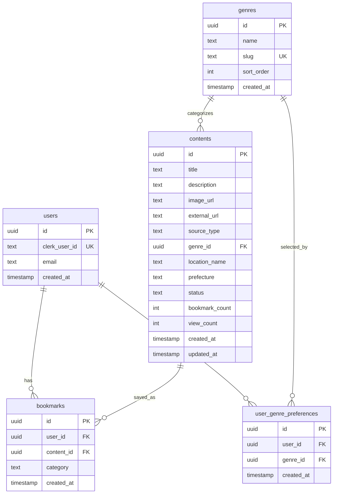

# データベース設計書 - MITORI

---

## 1. 概要

- **データベース：** PostgreSQL（Supabase）
- **認証との連携：** Clerkがユーザー認証を担当。SupabaseにはClerkの`userId`を持つ`users`テーブルを作成し、RLSで連携
- **RLS（Row Level Security）：** ユーザーデータ（bookmarks・user_genre_preferences）はRLSで本人のみアクセス可能

---

## 2. ER図



---

## 3. テーブル定義

### 3.1 users テーブル

ユーザー情報。Clerkが認証を管理し、SupabaseはClerkのuserIdを参照する。

| カラム名 | 型 | 制約 | 説明 |
|----------|----|------|------|
| id | uuid | PK, DEFAULT gen_random_uuid() | Supabase内部のユーザーID |
| clerk_user_id | text | NOT NULL, UNIQUE | Clerkが発行するユーザーID（`user_xxxxxxxx`形式） |
| email | text | NOT NULL | メールアドレス |
| created_at | timestamptz | NOT NULL, DEFAULT now() | 登録日時 |

**RLSポリシー：**
```sql
-- ユーザーは自分のレコードのみ参照可能
CREATE POLICY "users_select_own" ON users
  FOR SELECT USING (clerk_user_id = auth.jwt() ->> 'sub');
```

**備考：** Clerkのwebhook（`user.created`イベント）でSupabaseのusersテーブルへ自動挿入する。

---

### 3.2 genres テーブル

趣味ジャンルのマスターデータ。管理者が初期データを投入する。

| カラム名 | 型 | 制約 | 説明 |
|----------|----|------|------|
| id | uuid | PK, DEFAULT gen_random_uuid() | ジャンルID |
| name | text | NOT NULL | ジャンル名（例：キャンプ、温泉） |
| slug | text | NOT NULL, UNIQUE | URLスラグ（例：camp、onsen） |
| sort_order | int | NOT NULL, DEFAULT 0 | 表示順 |
| created_at | timestamptz | NOT NULL, DEFAULT now() | 作成日時 |

**初期データ：**
```sql
INSERT INTO genres (name, slug, sort_order) VALUES
  ('キャンプ', 'camp', 1),
  ('温泉', 'onsen', 2),
  ('サウナ', 'sauna', 3),
  ('バイク', 'bike', 4),
  ('釣り', 'fishing', 5),
  ('古着', 'vintage', 6),
  ('ウイスキー', 'whiskey', 7),
  ('国内旅行', 'travel', 8);
```

---

### 3.3 contents テーブル

管理者がキュレーションするコンテンツ。フィードに表示される。

| カラム名 | 型 | 制約 | 説明 |
|----------|----|------|------|
| id | uuid | PK, DEFAULT gen_random_uuid() | コンテンツID |
| title | text | NOT NULL | タイトル（最大100文字） |
| description | text | | 説明文（最大500文字） |
| image_url | text | NOT NULL | サムネイル画像URL |
| external_url | text | NOT NULL | 外部リンクURL（元記事・動画等） |
| source_type | text | NOT NULL | 出典元種別（後述のENUM参照） |
| genre_id | uuid | NOT NULL, FK → genres.id | ジャンルID |
| location_name | text | | 場所名（例：奥入瀬渓流） |
| prefecture | text | | 都道府県（例：青森県） |
| status | text | NOT NULL, DEFAULT 'draft' | 掲載ステータス（後述のENUM参照） |
| bookmark_count | int | NOT NULL, DEFAULT 0 | 「気になる」保存数（非正規化・集計値） |
| view_count | int | NOT NULL, DEFAULT 0 | 閲覧数 |
| created_at | timestamptz | NOT NULL, DEFAULT now() | 作成日時 |
| updated_at | timestamptz | NOT NULL, DEFAULT now() | 更新日時（トリガーで自動更新） |

**source_typeの値：**
- `note` / `x` / `youtube` / `instagram` / `blog` / `other`

**statusの値：**
- `draft`（下書き）/ `published`（公開）/ `unpublished`（非公開）

**インデックス：**
```sql
CREATE INDEX idx_contents_genre_id ON contents(genre_id);
CREATE INDEX idx_contents_status ON contents(status);
CREATE INDEX idx_contents_prefecture ON contents(prefecture);
-- 全文検索用（title + description + location_name）
CREATE INDEX idx_contents_fts ON contents
  USING gin(to_tsvector('japanese', coalesce(title,'') || ' ' || coalesce(description,'') || ' ' || coalesce(location_name,'')));
```

**updated_at自動更新トリガー：**
```sql
CREATE OR REPLACE FUNCTION update_updated_at()
RETURNS TRIGGER AS $$
BEGIN
  NEW.updated_at = now();
  RETURN NEW;
END;
$$ LANGUAGE plpgsql;

CREATE TRIGGER contents_updated_at
  BEFORE UPDATE ON contents
  FOR EACH ROW EXECUTE FUNCTION update_updated_at();
```

**RLSポリシー：**
```sql
-- 全ユーザー（匿名含む）が公開コンテンツを参照可能
CREATE POLICY "contents_select_published" ON contents
  FOR SELECT USING (status = 'published');

-- 管理者のみ全件参照・挿入・更新・削除可能
CREATE POLICY "contents_admin_all" ON contents
  FOR ALL USING (auth.jwt() ->> 'role' = 'admin');
```

---

### 3.4 bookmarks テーブル

ユーザーの「気になる」保存データ。RLSで本人のみアクセス可。

| カラム名 | 型 | 制約 | 説明 |
|----------|----|------|------|
| id | uuid | PK, DEFAULT gen_random_uuid() | ブックマークID |
| user_id | uuid | NOT NULL, FK → users.id | ユーザーID |
| content_id | uuid | NOT NULL, FK → contents.id | コンテンツID |
| category | text | NOT NULL, DEFAULT '未分類' | コレクションカテゴリ |
| created_at | timestamptz | NOT NULL, DEFAULT now() | 保存日時 |
| UNIQUE | (user_id, content_id) | | 同一コンテンツの二重保存を防止 |

**categoryの主な値：**
- `行きたい場所` / `欲しいもの` / `気になるスポット` / `未分類`

**インデックス：**
```sql
CREATE INDEX idx_bookmarks_user_id ON bookmarks(user_id);
CREATE INDEX idx_bookmarks_content_id ON bookmarks(content_id);
```

**RLSポリシー：**
```sql
ALTER TABLE bookmarks ENABLE ROW LEVEL SECURITY;

-- 本人のみSELECT可
CREATE POLICY "bookmarks_select_own" ON bookmarks
  FOR SELECT USING (user_id = (SELECT id FROM users WHERE clerk_user_id = auth.jwt() ->> 'sub'));

-- 本人のみINSERT可
CREATE POLICY "bookmarks_insert_own" ON bookmarks
  FOR INSERT WITH CHECK (user_id = (SELECT id FROM users WHERE clerk_user_id = auth.jwt() ->> 'sub'));

-- 本人のみDELETE可
CREATE POLICY "bookmarks_delete_own" ON bookmarks
  FOR DELETE USING (user_id = (SELECT id FROM users WHERE clerk_user_id = auth.jwt() ->> 'sub'));
```

**bookmark_count同期トリガー：**
```sql
-- INSERT時にbookmark_countをインクリメント
CREATE OR REPLACE FUNCTION increment_bookmark_count()
RETURNS TRIGGER AS $$
BEGIN
  UPDATE contents SET bookmark_count = bookmark_count + 1 WHERE id = NEW.content_id;
  RETURN NEW;
END;
$$ LANGUAGE plpgsql;

CREATE TRIGGER bookmarks_after_insert
  AFTER INSERT ON bookmarks
  FOR EACH ROW EXECUTE FUNCTION increment_bookmark_count();

-- DELETE時にbookmark_countをデクリメント
CREATE OR REPLACE FUNCTION decrement_bookmark_count()
RETURNS TRIGGER AS $$
BEGIN
  UPDATE contents SET bookmark_count = bookmark_count - 1 WHERE id = OLD.content_id;
  RETURN OLD;
END;
$$ LANGUAGE plpgsql;

CREATE TRIGGER bookmarks_after_delete
  AFTER DELETE ON bookmarks
  FOR EACH ROW EXECUTE FUNCTION decrement_bookmark_count();
```

---

### 3.5 user_genre_preferences テーブル

ユーザーが選択した趣味ジャンルの設定。

| カラム名 | 型 | 制約 | 説明 |
|----------|----|------|------|
| id | uuid | PK, DEFAULT gen_random_uuid() | ID |
| user_id | uuid | NOT NULL, FK → users.id | ユーザーID |
| genre_id | uuid | NOT NULL, FK → genres.id | ジャンルID |
| created_at | timestamptz | NOT NULL, DEFAULT now() | 設定日時 |
| UNIQUE | (user_id, genre_id) | | 同じジャンルの重複登録を防止 |

**RLSポリシー：**
```sql
ALTER TABLE user_genre_preferences ENABLE ROW LEVEL SECURITY;

CREATE POLICY "ugp_select_own" ON user_genre_preferences
  FOR SELECT USING (user_id = (SELECT id FROM users WHERE clerk_user_id = auth.jwt() ->> 'sub'));

CREATE POLICY "ugp_insert_own" ON user_genre_preferences
  FOR INSERT WITH CHECK (user_id = (SELECT id FROM users WHERE clerk_user_id = auth.jwt() ->> 'sub'));

CREATE POLICY "ugp_delete_own" ON user_genre_preferences
  FOR DELETE USING (user_id = (SELECT id FROM users WHERE clerk_user_id = auth.jwt() ->> 'sub'));
```

---

## 4. マイグレーション実行順序

1. `users` テーブル作成
2. `genres` テーブル作成 → 初期データ挿入
3. `contents` テーブル作成 → インデックス・トリガー作成
4. `bookmarks` テーブル作成 → RLS・トリガー設定
5. `user_genre_preferences` テーブル作成 → RLS設定

Supabase CLI を使用：
```bash
supabase db push
# または
supabase migration new create_initial_tables
```
