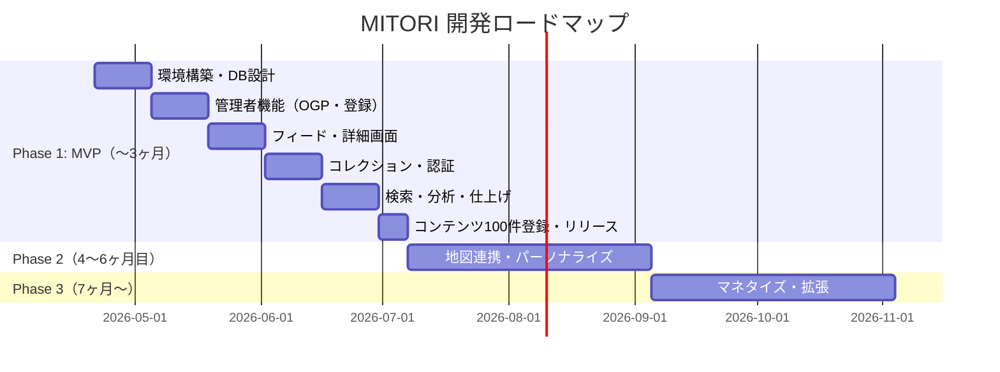

# 開発計画書 - MITORI

---

## 1. 開発方針

- **体制：** ソロ開発（1名）、Next.js初心者
- **方式：** POCアジャイル。2週間サイクルで動くものを作り、身近な40代男性に試してもらいフィードバックを得る
- **優先順位：** 完成度より検証速度。「動く最小限」を早く届ける

---

## 2. 開発ロードマップ

---

## 3. フェーズ別目標

### Phase 1：POC・MVP（〜3ヶ月）

**目標：** 身近な40代男性10〜30人に使ってもらい、「継続して使いたいか」を検証する

**成功基準：**
- 週1回以上起動するユーザーが30%以上（10人中3人）
- 1人あたりコレクション保存数が5件以上
- 「投稿しなくていいSNSなら使いたい」という反応が過半数

### Phase 2：継続率向上（4〜6ヶ月目）

**目標：** 継続率30%達成・フィードのパーソナライズ開始

- フィードのAIパーソナライズ（保存傾向から学習）
- 地図連携（「行きたい場所」をマップ表示）
- ダークモード・PWA対応
- プッシュ通知

### Phase 3：マネタイズ・拡張（7ヶ月〜）

**目標：** 収益モデルの確立

- 提携スポット・商品への予約・購入導線（アフィリエイト）
- ジャンル追加（ゴルフ・音楽・映画等）
- 法人向け掲載プラン

---

## 4. タスク分解（WBS）- Phase 1 詳細

### Week 1-2：環境構築・DB設計

- [ ] Next.js 14プロジェクト作成（`create-next-app --typescript`）
- [ ] Tailwind CSS + shadcn/ui セットアップ
- [ ] Supabaseプロジェクト作成・環境変数設定
- [ ] Clerkアプリ作成・Next.js統合（`@clerk/nextjs`）
- [ ] Vercelデプロイ設定（GitHubリポジトリ連携）
- [ ] DBマイグレーション実行（5テーブル作成）
  - [ ] usersテーブル
  - [ ] genresテーブル + 初期データ投入
  - [ ] contentsテーブル + インデックス + updated_atトリガー
  - [ ] bookmarksテーブル + RLS + bookmark_countトリガー
  - [ ] user_genre_preferencesテーブル + RLS
- [ ] Clerk webhook設定（user.created → Supabase users挿入）
- [ ] 環境変数の整理（`.env.local`）

---

### Week 3-4：管理者機能

- [ ] 管理者ロール設定（Clerkダッシュボードでadminロール付与）
- [ ] 管理者レイアウト作成（`/admin/layout.tsx`）
  - [ ] 管理者ロール認証チェック（未認証時は403）
- [ ] OGPスクレイピングAPI実装（`/api/admin/scrape-ogp`）
  - [ ] `cheerio` + `node-fetch` インストール
  - [ ] OGPメタタグ抽出ロジック
  - [ ] source_type自動判定（URLドメインから）
  - [ ] タイムアウト処理（5秒）
- [ ] コンテンツ登録フォーム（`/admin/contents/new`）
  - [ ] React Hook Form + Zod バリデーション設定
  - [ ] OGPスクレイピング呼び出し＋フォーム自動入力
  - [ ] 画像URLプレビュー表示
  - [ ] Supabase Storage へのファイルアップロード（任意）
  - [ ] Server Actionでの登録処理
- [ ] コンテンツ一覧・編集・削除（`/admin/contents`）
  - [ ] ステータス・ジャンルフィルター
  - [ ] 掲載ステータス切り替え（下書き/公開/非公開）

---

### Week 5-6：ユーザー向けフィード

- [ ] ホームフィード（`/` - Server Component）
  - [ ] Supabaseからコンテンツ取得（published のみ）
  - [ ] カード型グリッドレイアウト（1/2/3カラム）
  - [ ] 画像遅延読み込み（Next.js `<Image>`コンポーネント）
- [ ] ジャンルフィルタータブ（Client Component）
  - [ ] URL searchParamsでジャンル管理
  - [ ] 横スクロール対応
- [ ] コンテンツ詳細画面（`/contents/[id]`）
  - [ ] 大画像・説明文・場所情報・人数表示
  - [ ] 外部リンクボタン（新規タブで遷移）
  - [ ] 閲覧数インクリメント（Server Action）
- [ ] ボトムナビゲーション（Client Component）
- [ ] レスポンシブ対応確認（スマホ・タブレット・PC）

---

### Week 7-8：コレクション・認証フロー

- [ ] 「気になる」ボタン（Client Component）
  - [ ] 楽観的UI更新（`useState` + `useTransition`）
  - [ ] Server Action（toggleBookmark）実装
  - [ ] 未ログイン時のClerkログインモーダル誘導
- [ ] カテゴリ選択モーダル（ボトムシート形式）
  - [ ] shadcn/ui の Sheet コンポーネント活用
- [ ] コレクション一覧（`/collection`）
  - [ ] カテゴリタブ切り替え
  - [ ] サムネイルグリッド表示
  - [ ] 「気になる」解除機能
- [ ] 初回オンボーディング（`/onboarding`）
  - [ ] ジャンル選択画面
  - [ ] Supabaseへの設定保存
- [ ] 認証フロー確認（登録・ログイン・自動セッション維持）

---

### Week 9-10：検索・分析

- [ ] 検索画面（`/search`）
  - [ ] キーワード検索（タイトル・説明・場所名の全文検索）
  - [ ] 都道府県フィルター（セレクトボックス）
  - [ ] 検索結果のカードグリッド表示
- [ ] 管理者分析ダッシュボード（`/admin/analytics`）
  - [ ] ジャンル別コンテンツ数・保存数の集計
  - [ ] 人気コンテンツランキング（保存数順）
  - [ ] shadcn/ui のテーブルコンポーネント活用

---

### Week 11-12：仕上げ・リリース準備

- [ ] UIの全体的な磨き込み（余白・色・タイポグラフィ調整）
- [ ] ウェルカム画面作成（`/welcome`）
- [ ] プライバシーポリシーページ作成
- [ ] コンテンツ100件の登録（OGPスクレイピング活用）
- [ ] レスポンシブの最終確認（実機テスト：iPhone・iPad・PC）
- [ ] Vercel本番環境へのデプロイ・動作確認
- [ ] カスタムドメイン設定（任意）
- [ ] 身近な40代男性へのベータ公開

---

## 5. 開発環境・ツール

| ツール | 用途 |
|--------|------|
| Cursor | AIアシスト付きコードエディタ。実装の主要ツール |
| GitHub | ソースコード管理 |
| Vercel | CI/CDパイプライン（GitHubプッシュで自動デプロイ） |
| Supabase Dashboard | DB管理・SQL実行・ログ確認 |
| Clerk Dashboard | ユーザー管理・ロール設定・webhook設定 |

---

## 6. リスク管理

| No | リスク内容 | 影響度 | 発生確率 | 対応策 |
|----|-----------|--------|---------|--------|
| R1 | Next.js学習コストで進捗遅延 | 高 | 高 | shadcn/ui・公式テンプレートから開始。Cursorで実装支援。Week単位でスコープ調整 |
| R2 | OGPスクレイピング失敗 | 中 | 中 | 手動入力フォームを必ずバックアップとして提供 |
| R3 | コンテンツ量不足でフィードが空洞化 | 高 | 中 | リリース前に100件確保してから公開。OGPスクレイピングで登録工数削減 |
| R4 | 「見るだけ」で離脱が多い | 高 | 中 | コレクション保存のUXを磨く。初回オンボーディングで保存を体験させる |
| R5 | Supabase RLSの設定ミス | 中 | 中 | 本番前にRLSポリシーを十分にテスト。他ユーザーのデータが見えないことを確認 |
| R6 | スケジュールが3ヶ月を超える | 中 | 高 | スコープを削減してでも「動くもの」を出すことを優先。Week単位でスコープを再評価 |

---

## 7. 完了の定義（DoD: Definition of Done）

各タスクが「完了」と言えるための基準：

- [ ] 主要機能が意図通りに動作する（手動テスト済み）
- [ ] スマホ・タブレット・PCでレイアウト崩れがない
- [ ] 未ログイン・ログイン済みの両状態で動作確認済み
- [ ] Vercelプレビューデプロイで動作確認済み
- [ ] TypeScriptのコンパイルエラーがない

---

## 8. 参考リソース

| リソース | URL |
|---------|-----|
| Next.js 公式ドキュメント | https://nextjs.org/docs |
| Supabase 公式ドキュメント | https://supabase.com/docs |
| Clerk + Next.js クイックスタート | https://clerk.com/docs/quickstarts/nextjs |
| shadcn/ui コンポーネント | https://ui.shadcn.com/ |
| Tailwind CSS | https://tailwindcss.com/docs |
| Vercel デプロイガイド | https://vercel.com/docs/deployments |
