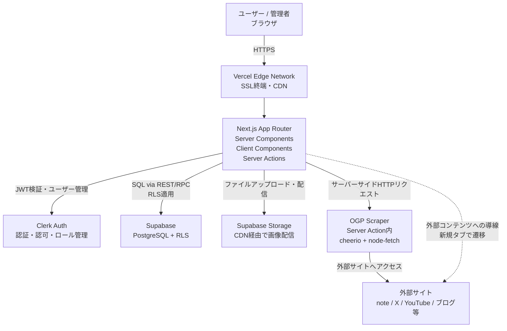

# システムアーキテクチャ設計書 - MITORI

---

## 1. 技術スタック

| レイヤー | 技術 | バージョン | 選定理由 |
|----------|------|-----------|---------|
| フロントエンド | Next.js | 14.x（App Router） | SSR/SSGで高速表示。Vercelとの親和性最高。学習リソースが豊富 |
| 言語 | TypeScript | 5.x | 型安全で初心者でもバグを早期発見しやすい |
| スタイリング | Tailwind CSS | 3.x | クラス名だけでUIが作れる。レスポンシブ対応が容易 |
| UIコンポーネント | shadcn/ui | 最新 | Tailwind + Radix UIベース。コピペで使える高品質コンポーネント集 |
| バックエンド | Next.js App Router（Server Actions + API Routes） | 14.x | フロントと同一リポジトリ。サーバーレスで運用コストゼロ |
| データベース | Supabase（PostgreSQL） | 最新 | RLSで行レベルセキュリティ。ダッシュボードでDB管理が容易。無料枠あり |
| 認証 | Clerk | 最新 | 実装コストが低い。UIコンポーネント標準提供。Next.jsとの統合が簡単 |
| OGPスクレイピング | cheerio + node-fetch | 最新 | 外部API不要。Next.js API Routeで実装。無料 |
| 画像ストレージ | Supabase Storage | - | DBと同じサービスで管理一元化。無料枠内で開始可能 |
| ホスティング | Vercel | - | Next.jsとの親和性最高。Hobbyプランは無料。エッジネットワーク配信 |

---

## 2. アーキテクチャ概要図



### 各コンポーネントの役割

| コンポーネント | 役割 |
|--------------|------|
| Vercel Edge Network | SSL終端、CDNによる静的アセット配信、エッジキャッシュ |
| Next.js App Router | UIレンダリング（SSR/SSG）、APIルーティング、Server Actions処理 |
| Clerk | ユーザー認証・セッション管理・ロールベースアクセス制御（管理者/一般ユーザー） |
| Supabase PostgreSQL | コンテンツ・ユーザー・ブックマークデータの永続化。RLSで行レベルセキュリティ |
| Supabase Storage | 管理者がアップロードした画像ファイルの保存とCDN配信 |
| OGP Scraper | Server Action内でURLからOGP情報（タイトル・画像・説明）を取得 |

---

## 3. Next.js App Routerのディレクトリ構成

```
src/
├── app/
│   ├── layout.tsx                    # ルートレイアウト（ClerkProvider）
│   ├── page.tsx                      # ホームフィード（Server Component）
│   ├── contents/
│   │   └── [id]/
│   │       └── page.tsx              # コンテンツ詳細（Server Component）
│   ├── collection/
│   │   └── page.tsx                  # コレクション一覧（Server Component）
│   ├── search/
│   │   └── page.tsx                  # 検索画面（Server Component）
│   ├── settings/
│   │   └── page.tsx                  # 設定画面（Server Component）
│   ├── onboarding/
│   │   └── page.tsx                  # ジャンル選択（Client Component）
│   ├── admin/
│   │   ├── layout.tsx                # 管理者レイアウト（ロール認証）
│   │   ├── page.tsx                  # 管理ダッシュボード
│   │   ├── contents/
│   │   │   ├── page.tsx              # コンテンツ一覧
│   │   │   ├── new/page.tsx          # 新規登録
│   │   │   └── [id]/edit/page.tsx    # 編集
│   │   └── analytics/
│   │       └── page.tsx              # 分析画面
│   └── api/
│       ├── bookmarks/
│       │   ├── route.ts              # GET/POST
│       │   └── [id]/route.ts         # DELETE
│       ├── contents/
│       │   └── route.ts              # GET
│       └── admin/
│           ├── contents/
│           │   └── route.ts          # POST/PUT/DELETE
│           └── scrape-ogp/
│               └── route.ts          # POST
├── components/
│   ├── ui/                           # shadcn/uiコンポーネント
│   ├── feed/
│   │   ├── ContentGrid.tsx           # Server Component
│   │   ├── ContentCard.tsx           # Server Component
│   │   └── GenreFilterBar.tsx        # Client Component
│   ├── content/
│   │   ├── ContentDetail.tsx         # Server Component
│   │   ├── BookmarkButton.tsx        # Client Component
│   │   └── ExternalLinkButton.tsx    # Client Component
│   ├── collection/
│   │   ├── CategoryTabs.tsx          # Client Component
│   │   └── CollectionGrid.tsx        # Client Component
│   ├── admin/
│   │   ├── ContentForm.tsx           # Client Component
│   │   ├── OGPFetcher.tsx            # Client Component
│   │   └── AnalyticsDashboard.tsx    # Client Component
│   └── layout/
│       ├── Header.tsx                # Server Component
│       ├── BottomNav.tsx             # Client Component
│       └── AuthButton.tsx            # Client Component
├── lib/
│   ├── supabase/
│   │   ├── client.ts                 # ブラウザ用Supabaseクライアント
│   │   └── server.ts                 # サーバー用Supabaseクライアント
│   └── utils.ts                      # ユーティリティ関数
├── actions/
│   ├── bookmark.ts                   # ブックマーク操作 Server Actions
│   ├── content.ts                    # コンテンツ操作 Server Actions（管理者）
│   └── scrape.ts                     # OGPスクレイピング Server Actions
└── types/
    └── index.ts                      # 型定義
```

---

## 4. コンポーネント設計

### 4.1 Server / Client Component の判断基準

| 種別 | 使用場面 |
|------|---------|
| **Server Component** | データ取得（Supabase）、静的なUI表示、SEOが必要な部分 |
| **Client Component** | インタラクション（ボタンクリック・モーダル・タブ切り替え）、`useState`/`useEffect`が必要な部分 |

### 4.2 主要コンポーネント定義

#### ContentCard（Server Component）
```typescript
// src/components/feed/ContentCard.tsx
import type { Content, Genre } from '@/types'

type ContentCardProps = {
  content: {
    id: string
    title: string
    image_url: string
    genre: Pick<Genre, 'id' | 'name'>
    location_name: string | null
    prefecture: string | null
    bookmark_count: number
  }
  isBookmarked: boolean  // Serverで解決してpropsとして渡す
}

// → Server ComponentのためDBアクセス可。async関数として定義可
export default async function ContentCard({ content, isBookmarked }: ContentCardProps) { ... }
```

#### BookmarkButton（Client Component）
```typescript
// src/components/content/BookmarkButton.tsx
'use client'
import { useState, useTransition } from 'react'
import { toggleBookmark } from '@/actions/bookmark'

type BookmarkButtonProps = {
  contentId: string
  initialIsBookmarked: boolean
  initialBookmarkCount: number
  defaultCategory?: string
}

// 状態管理: useState（楽観的UI更新）
// useTransitionでServer Actionの非同期処理を管理
// カテゴリ選択モーダルの開閉もuseStateで管理
```

#### ContentForm（Client Component - 管理者）
```typescript
// src/components/admin/ContentForm.tsx
'use client'
import { useForm } from 'react-hook-form'
import { zodResolver } from '@hookform/resolvers/zod'
import { z } from 'zod'

const contentSchema = z.object({
  title: z.string().min(1, '必須').max(100),
  description: z.string().max(500).optional(),
  image_url: z.string().url('有効なURLを入力してください'),
  external_url: z.string().url('有効なURLを入力してください'),
  source_type: z.enum(['note', 'x', 'youtube', 'instagram', 'blog', 'other']),
  genre_id: z.string().uuid(),
  location_name: z.string().optional(),
  prefecture: z.string().optional(),
  status: z.enum(['draft', 'published', 'unpublished']),
})

type ContentFormValues = z.infer<typeof contentSchema>
// 状態管理: React Hook Form + Zod
// OGPスクレイピングはfetchOGPAction（Server Action）を呼び出し
```

#### GenreFilterBar（Client Component）
```typescript
// src/components/feed/GenreFilterBar.tsx
'use client'
import { useRouter, useSearchParams } from 'next/navigation'

// URL searchParams（?genre=camp）でジャンルを管理
// タブ選択でrouterをpushしてServer Componentを再レンダリング
```

---

## 5. データフロー

### ホームフィード表示フロー
```
ブラウザ → Vercel Edge → Next.js Server (page.tsx)
  → Supabase: SELECT contents WHERE status='published' [ジャンル・ページネーション]
  → Supabase: SELECT bookmarks WHERE user_id={userId} (ログイン時のみ)
  → HTML生成（SSR） → ブラウザへHTMLを返す
  → Client: ContentGrid/ContentCard はHydration
```

### 「気になる」保存フロー
```
ブラウザ (BookmarkButton click)
  → Client: useState で楽観的にUI更新
  → Server Action (toggleBookmark)
    → Clerk: ユーザーID取得
    → Supabase: INSERT bookmarks (RLSで認可チェック)
    → Supabase: UPDATE contents SET bookmark_count = bookmark_count + 1
  → 成功: トースト通知表示
  → 失敗: 楽観的更新を元に戻す + エラートースト
```

### OGPスクレイピングフロー
```
ブラウザ (管理者 - URLを入力して「取得」ボタン)
  → Server Action (scrapeOGP)
    → node-fetch: 対象URLにHTTPリクエスト
    → cheerio: HTMLをパース、OGPメタタグを抽出
    → { title, description, image_url, source_type } を返す
  → Client: フォームに自動入力
```
