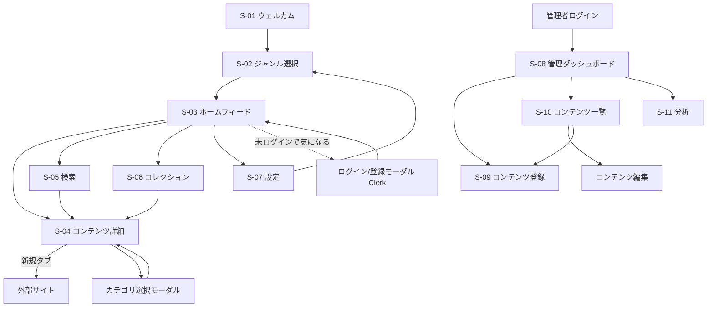

# UI/UXデザイン設計書 - MITORI

---

## 1. デザインコンセプト

### 基本思想
**「静かな上質感（Quiet Luxury）」**

40代男性が就寝前・通勤中にリラックスして使えるデザイン。コンテンツ画像が主役で、UIが主張しすぎない。雑誌をめくるような体験。

### デザインキーワード
- **静寂（Quiet）** ── 騒がしい通知・数字・バッジを排除
- **上質（Quality）** ── 余白・タイポグラフィで品格を表現
- **没入（Immersive）** ── 画像が大きく、スクロールが気持ちいい
- **シンプル（Simple）** ── 操作は最小限。迷わせない
- **余白（Breathing room）** ── カード間・要素間に十分な余白

---

## 2. デザインシステム

### 2.1 カラーパレット

```
背景色
  --color-bg-primary:     #F7F5F2   (オフホワイト - メイン背景)
  --color-bg-secondary:   #EFEDE9   (薄いベージュ - カード背景)
  --color-bg-overlay:     #FFFFFF   (モーダル・シート背景)

テキスト色
  --color-text-primary:   #2C2C2C   (ダークグレー - メインテキスト)
  --color-text-secondary: #6B6B6B   (ミディアムグレー - サブテキスト)
  --color-text-muted:     #A0A0A0   (ライトグレー - プレースホルダー等)

ブランドカラー
  --color-brand-primary:  #2D4A3E   (ディープグリーン - ヘッダー・アクセント)
  --color-brand-accent:   #8B6F47   (アースブラウン - 「気になる」ボタン等)

ボーダー・区切り
  --color-border:         #E2DED8   (薄いグレーベージュ)
  --color-divider:        #D4CFC8   (区切り線)

ステータス色
  --color-success:        #4CAF78   (緑 - 保存完了等)
  --color-error:          #C0392B   (赤 - エラー)
```

### 2.2 タイポグラフィ

```css
/* フォントファミリー */
--font-sans: 'Noto Sans JP', 'Hiragino Sans', sans-serif;

/* 見出し */
--text-2xl: 24px / line-height: 1.4 / font-weight: 700   (ページタイトル)
--text-xl:  20px / line-height: 1.4 / font-weight: 700   (セクションタイトル)
--text-lg:  18px / line-height: 1.5 / font-weight: 600   (カードタイトル)

/* 本文 */
--text-base: 16px / line-height: 1.7 / font-weight: 400  (説明文)
--text-sm:   14px / line-height: 1.6 / font-weight: 400  (メタ情報・タグ)
--text-xs:   12px / line-height: 1.5 / font-weight: 400  (注釈・ラベル)
```

### 2.3 スペーシング（Tailwind基準）

```
--spacing-xs:   4px  (p-1)   タグ内padding等
--spacing-sm:   8px  (p-2)   コンパクトな余白
--spacing-md:   16px (p-4)   標準的な余白
--spacing-lg:   24px (p-6)   セクション間
--spacing-xl:   32px (p-8)   ページ余白
--spacing-2xl:  48px (p-12)  大きなセクション間
```

### 2.4 カードデザイン

```
角丸:      border-radius: 12px (rounded-xl)
影:        box-shadow: 0 2px 8px rgba(0,0,0,0.08)
画像比率:  aspect-ratio: 4/3（モバイル）/ 3/2（PC）
ホバー:    transform: translateY(-2px), shadow増大（PC）
```

### 2.5 ボトムナビゲーション（モバイル）

```
高さ:     64px（safe-area-inset-bottom考慮）
背景:     white / border-top: 1px solid --color-border
アイコン: 24px outline → 選択時 filled + --color-brand-primary
ラベル:   12px
```

---

## 3. 画面一覧

| 画面ID | 画面名 | パス | 説明 |
|--------|--------|------|------|
| S-01 | ウェルカム画面 | `/welcome` | 初回訪問時のコンセプト説明 |
| S-02 | ジャンル選択 | `/onboarding` | 趣味ジャンルの初期設定 |
| S-03 | ホームフィード | `/` | メインのビジュアルフィード |
| S-04 | コンテンツ詳細 | `/contents/[id]` | 詳細情報・外部リンク・気になる |
| S-05 | 検索 | `/search` | キーワード・場所検索 |
| S-06 | コレクション | `/collection` | 保存したコンテンツ一覧 |
| S-07 | 設定 | `/settings` | ジャンル変更・アカウント |
| S-08 | 管理ダッシュボード | `/admin` | 管理者向けトップ |
| S-09 | コンテンツ登録 | `/admin/contents/new` | OGPスクレイピング＋手動登録 |
| S-10 | コンテンツ一覧（管理） | `/admin/contents` | 登録済みコンテンツ管理 |
| S-11 | 分析画面 | `/admin/analytics` | 閲覧数・保存数の集計 |

---

## 4. 画面遷移図



---

## 5. ワイヤーフレーム

### 5.1 S-03 ホームフィード（モバイル）

```
┌─────────────────────────┐
│ [MITORI]        [検索🔍] │  ← ヘッダー（ディープグリーン背景、白テキスト）
├─────────────────────────┤
│ [キャンプ][温泉][サウナ] │  ← ジャンルタブ（横スクロール）
│ [バイク][釣り][古着]..  │
├─────────────────────────┤
│ ┌───────────────────┐   │
│ │                   │   │
│ │     画像 (4:3)    │ 🔖 │  ← コンテンツカード
│ │                   │   │     右下：ブックマークアイコン
│ ├───────────────────┤   │
│ │ [キャンプ] 青森県 │   │  ← ジャンルタグ・場所
│ │ 奥入瀬渓流キャンプ│   │  ← タイトル（2行まで）
│ │ 場の魅力を全て紹介│   │
│ │ 234人が気になって │   │  ← 人数表示
│ └───────────────────┘   │
│                         │
│ ┌───────────────────┐   │
│ │     画像 (4:3)    │ 🔖 │
│ │                   │   │
│ └───────────────────┘   │
│     ：（以下スクロール）  │
├─────────────────────────┤
│  🏠ホーム  🔍検索  📁コレクション  ⚙設定  │  ← ボトムナビ
└─────────────────────────┘

レスポンシブ対応：
- モバイル（~768px）: 1カラム
- タブレット（768px~）: 2カラムグリッド
- PC（1280px~）: 3カラムグリッド
```

---

### 5.2 S-04 コンテンツ詳細（モバイル）

```
┌─────────────────────────┐
│ ← 戻る                  │  ← ナビゲーションバー
├─────────────────────────┤
│                         │
│                         │
│      画像（16:9）        │  ← 大きな画像（画面幅いっぱい）
│                         │
│                         │
├─────────────────────────┤
│ [キャンプ]              │  ← ジャンルタグ
│                         │
│ 奥入瀬渓流キャンプ場の  │  ← タイトル（大きめ・太字）
│ 魅力を全て紹介          │
│                         │
│ 📍 奥入瀬渓流 / 青森県  │  ← 場所情報
│ 🔗 出典：note           │  ← 出典元
│                         │
│ 234人が気になっています  │  ← 人数表示（控えめに）
│                         │
│ 青森の大自然に囲まれた  │
│ 静かなキャンプ場。渓流  │  ← 説明文
│ 沿いのサイトが魅力で... │
│                         │
│ ┌──────────────────┐   │
│ │  🔖 気になる     │   │  ← 気になるボタン（アースブラウン）
│ └──────────────────┘   │
│ ┌──────────────────┐   │
│ │  ↗ 記事を読む   │   │  ← 外部リンクボタン（ボーダースタイル）
│ └──────────────────┘   │
└─────────────────────────┘
```

---

### 5.3 S-09 コンテンツ登録（管理者・PC）

```
┌────────────────────────────────────────────────────┐
│ MITORI Admin > コンテンツ登録                        │
├────────────────────────────────────────────────────┤
│                                                    │
│  URLから自動取得                                    │
│  ┌──────────────────────────────────┐ [取得]       │
│  │ https://note.com/...             │              │
│  └──────────────────────────────────┘              │
│  ※取得できない場合は手動で入力してください           │
│                                                    │
│  ─────────────── または手動入力 ──────────────────  │
│                                                    │
│  タイトル *              説明文                     │
│  ┌──────────────────┐   ┌────────────────────────┐ │
│  │                  │   │                        │ │
│  └──────────────────┘   │                        │ │
│                         └────────────────────────┘ │
│  画像URL *              プレビュー                  │
│  ┌──────────────────┐   ┌──────────────┐          │
│  │                  │   │              │          │
│  └──────────────────┘   │   (画像)     │          │
│  [または画像をアップ]    │              │          │
│                         └──────────────┘          │
│  外部リンクURL *  出典元       ジャンル *           │
│  ┌────────────┐  ┌──────────┐ ┌──────────────┐   │
│  │            │  │ note ▼   │ │ キャンプ ▼   │   │
│  └────────────┘  └──────────┘ └──────────────┘   │
│                                                    │
│  場所名              都道府県     ステータス *       │
│  ┌────────────┐  ┌──────────┐ ┌──────────────┐   │
│  │            │  │ 青森県 ▼ │ │ 下書き   ▼   │   │
│  └────────────┘  └──────────┘ └──────────────┘   │
│                                                    │
│                      [キャンセル] [保存する]        │
└────────────────────────────────────────────────────┘
```

---

## 6. インタラクション仕様

### 「気になる」ボタンのアニメーション
1. タップ → アイコンが微細にバウンス（scale: 1.0 → 1.3 → 1.0、200ms）
2. 未保存（アウトライン）→ 保存済み（アースブラウン塗りつぶし）に変化
3. 下部にトーストが表示「コレクションに保存しました ✓」（2秒後に自動消去）

### カード詳細への遷移
- モバイル：ボトムシートがスライドアップ（画面下から全画面へ）
- PC：新規ページへ遷移

### ジャンルフィルターのスクロール
- 横スクロール対応。選択中のタブは下線＋テキスト色をディープグリーンに変化
- URLのsearchParamsを更新してServer Componentを再レンダリング

### カテゴリ選択モーダル
- ボトムシート形式（モバイル）
- 選択肢：「行きたい場所」「欲しいもの」「気になるスポット」「未分類」
- タップで即時保存・モーダルを閉じる

### エラー表示
- 操作失敗：赤いトーストで表示「保存に失敗しました。再試行してください」
- フォームバリデーション：入力フィールド下にインラインで赤文字表示
- オフライン：上部に青いバナー「インターネット接続がありません」

---

## 7. レスポンシブ対応方針

| ブレークポイント | 主な変更 |
|----------------|---------|
| `< 768px`（モバイル） | 1カラムフィード、ボトムナビ表示、カード詳細はフルスクリーン |
| `768px ~`（タブレット） | 2カラムフィード、ボトムナビ非表示・サイドナビ表示 |
| `1280px ~`（PC） | 3カラムフィード、左サイドバーナビ、カード詳細は右ペイン or 別ページ |

Tailwind CSSのブレークポイントをそのまま活用：
```
sm: 640px  md: 768px  lg: 1024px  xl: 1280px
```
