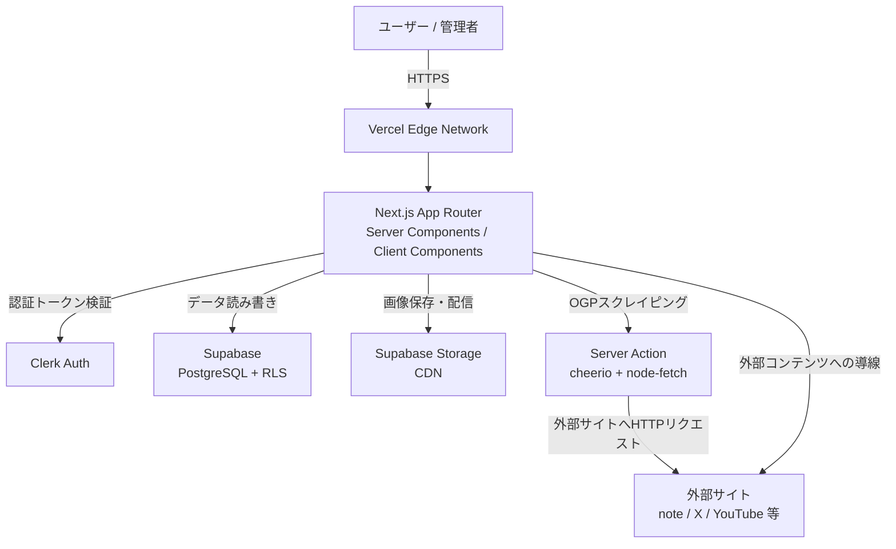
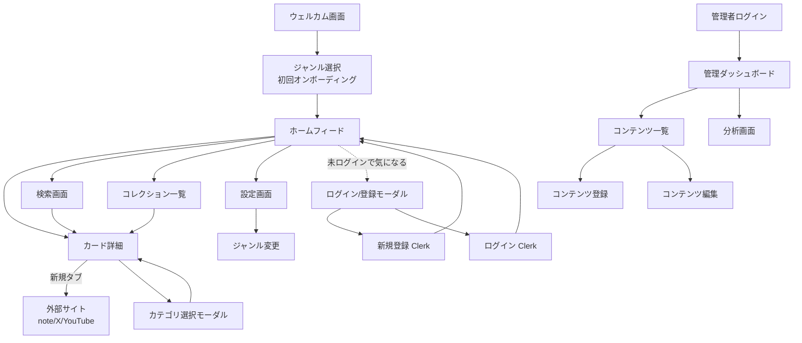
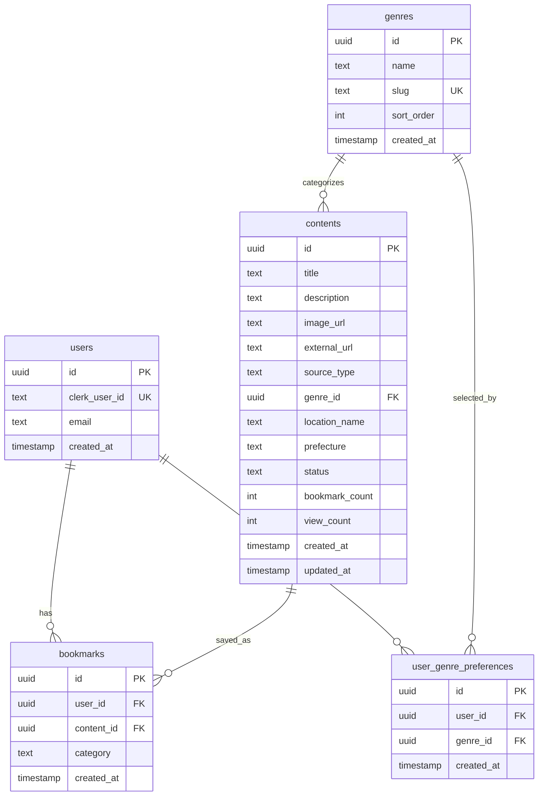
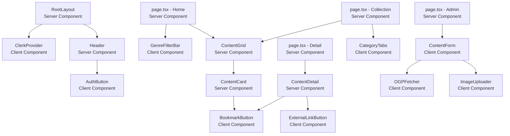

# 要件定義書 - MITORI（読むだけSNS）

---

## 1. プロジェクト概要

### 1.1 プロジェクト名

**「MITORI - 読むだけSNS 開発プロジェクト」**

### 1.2 背景・目的

**背景：**
40代男性のSNS未使用者の多くは「発信したいことがない」「必要性を感じない」という理由でSNSを避けている。しかし趣味（キャンプ・温泉・サウナ・バイク・釣り・古着・ウイスキー・国内旅行）に関する良質な情報は欲しいと感じている。開発者自身もその当事者であり、既存SNSへの参入障壁（発信プレッシャー・アカウント作成の煩わしさ・関係ない情報の多さ）を解消するプロダクトが必要だと感じている。

**目的：**
- 「投稿しなくていい」を明示的なコアコンセプトとするビジュアルフィードアプリをPOCとして開発
- 40代男性SNS未使用者の参入障壁を下げ、趣味の情報収集を豊かにする
- 週1回以上継続利用するユーザーを3ヶ月後に30人獲得し、ビジネス仮説を検証する

### 1.3 システムのビジョン / スコープ

**ビジョン：**
40代男性が就寝前や通勤中に、発信プレッシャーゼロで趣味のビジュアルコンテンツを眺め、気になったものをコレクションに貯めていく。SNSなのに静かで上質。「自分だけの趣味マップ」が育っていく体験を提供する。

**今回のスコープ（MVP）：**
- レスポンシブWebアプリ（スマホ・タブレット・PC対応）
- ビジュアルフィード・ジャンルフィルター・キーワード検索
- 「気になる」保存・コレクション管理
- 管理者によるコンテンツ登録（OGPスクレイピング＋手動入力）・掲載管理
- ユーザー反応の基本的な分析ダッシュボード

**スコープ外（将来対応）：**
- AIによるフィードパーソナライズ
- 地図連携（Google Maps等）
- PWA・オフライン対応
- 法人向け掲載プラン・マネタイズ機能

---

## 2. ビジネス要件

### 2.1 ビジネスモデル情報

**リーンキャンバス要約：**

| 項目 | 内容 |
|------|------|
| 課題 | SNS未使用の40代男性が「発信プレッシャーなしに趣味の良質情報を受信できる場」がない |
| 顧客セグメント | 40代男性・SNS未使用・キャンプ/温泉/バイク等の趣味持ち |
| 価値提案 | 投稿ゼロでOK。流れてくる趣味のビジュアルを眺めて、気になるものをコレクション |
| 解決策 | 完全受信型ビジュアルフィード＋コレクション管理 |
| 収益の流れ（仮） | 趣味関連スポット・商品への送客手数料（Phase 3） |
| コスト構造 | 開発コスト（ソロ）、インフラコスト（無料枠メイン）、コンテンツキュレーション工数 |
| 差別化 | 投稿機能の完全排除、40代男性向けライフスタイル特化、日本語コンテンツ品質 |

**競争優位性（7Powers視点）：**
- **スイッチングコスト：** コレクションが積み上がるほど乗り換えにくくなる
- **カウンターポジショニング：** 既存SNS（Instagram等）は「発信できること」が前提の設計。発信を排除した設計は大手が真似しにくい

### 2.2 成果指標（KPI/KGI）

| 指標 | 目標値 | 計測タイミング |
|------|--------|--------------|
| 週1回以上起動するアクティブユーザー（WAU） | 30人 | MVP後3ヶ月 |
| 1人あたりコレクション保存数 | 5件以上 | MVP後1ヶ月 |
| 1セッションあたり平均閲覧カード数 | 5枚以上 | リリース後随時 |
| コンテンツ登録数 | 100件（リリース時） | リリース前 |

### 2.3 ビジネス上の制約

- 予算：コスト最小化優先。各種サービスの無料枠内で運用開始
- 開発体制：ソロ（1名）。初心者
- 期間：POCとして3ヶ月以内にリリース
- 法的：個人情報保護法に準拠。OGP画像は外部URLの参照（直リンク）。プライバシーポリシー必須

---

## 3. ユーザー要件

### 3.1 ユーザープロファイル / ペルソナ

**ペルソナA：山田 浩二（44歳）**
- 会社員（中間管理職）、妻・子供と郊外在住
- 趣味：キャンプ・温泉・バイクツーリング・ウイスキー
- 利用デバイス：iPhone（通勤中）、iPad（就寝前）、MacBook（週末の計画立て）
- 課題：情報がGoogle/YouTube/雑誌に散在。SNSは「投稿しなきゃいけない」感が嫌
- インサイト：「流れてくる良質なビジュアルを眺めたい。投稿は一切したくない」

**ペルソナB：佐藤 健太（47歳）**
- 自営業（デザイン業）、独身、都市部在住
- 趣味：古着・ヴィンテージ・サウナ・クラフトビール
- 利用デバイス：Android（移動中）、PC（仕事の合間）
- 課題：古着情報はInstagramが充実しているがアカウントを持ちたくない
- インサイト：「趣味ごとにアプリを使い分けたくない。一ヶ所でまとめて見たい」

### 3.2 ユーザーストーリー

1. **「40代男性のSNS未使用者として、アカウント登録せずに趣味のビジュアルフィードを閲覧したい。なぜなら、まず試してみてから登録するか判断したいからだ。」**

2. **「趣味の情報収集者として、キャンプ・温泉・バイクなど複数の趣味をまたいで一ヶ所でビジュアル情報を得たい。なぜなら、趣味ごとにアプリを使い分けるのが面倒だからだ。」**

3. **「週末の計画を立てたい人として、気になったキャンプ場や温泉をコレクションに保存しておきたい。なぜなら、後で見返してプランを立てたいからだ。」**

4. **「場所を探している人として、都道府県名や場所名でコンテンツを検索したい。なぜなら、特定のエリアで行ける場所を効率よく見つけたいからだ。」**

5. **「管理者（開発者）として、URLを入力するだけでOGPから画像・タイトル・説明文を自動取得してコンテンツを登録したい。なぜなら、コンテンツ登録の工数を最小化したいからだ。」**

### 3.3 MVP（Minimum Viable Product）の定義

**MVPで実装する範囲：**
- 匿名閲覧（登録なしでフィード閲覧可）
- ジャンルフィルター付きホームフィード
- キーワード・場所検索
- カード詳細・外部リンク遷移
- 「気になる」保存・コレクション管理（ログイン必須）
- メール認証によるアカウント登録
- 管理者向けコンテンツ登録・掲載管理（OGPスクレイピング＋手動入力）
- 基本的な分析ダッシュボード（保存数・閲覧数）

**MVPのゴール：**
身近な40代男性10〜30人に使ってもらい、「継続して使いたいか」「コレクション機能に価値があるか」を検証する。

---

## 4. 機能要件

### 4.1 機能一覧 / MoSCoW 分類

| 機能ID | 機能名 | 要約 | Must/Should/Could/Won't | MVP対象 |
|--------|--------|------|------------------------|---------|
| F-001 | 匿名閲覧 | アカウントなしでフィード閲覧のみ可能 | Must | Yes |
| F-002 | アカウント登録・ログイン | メールアドレス＋パスワードで登録（Clerk） | Must | Yes |
| F-003 | ホームフィード表示 | カード型グリッド・無限スクロール | Must | Yes |
| F-004 | ジャンルフィルター | 8ジャンルのタブ切り替え | Must | Yes |
| F-005 | カード詳細表示 | 大画像・説明・出典・人数表示 | Must | Yes |
| F-006 | 外部リンク遷移 | 新規タブで外部サイトへ遷移 | Must | Yes |
| F-007 | 「気になる」保存 | 1タップでコレクションに追加 | Must | Yes |
| F-008 | コレクション一覧 | カテゴリ別サムネイル表示 | Must | Yes |
| F-009 | 初回ジャンル選択 | オンボーディングでジャンル選択 | Must | Yes |
| F-010 | コンテンツ登録（管理者） | OGPスクレイピング＋手動入力 | Must | Yes |
| F-011 | 掲載ステータス管理（管理者） | 下書き/公開/非公開の切り替え | Must | Yes |
| F-012 | キーワード・場所検索 | 場所名・都道府県・キーワードで検索 | Should | Yes |
| F-013 | 「〇人が気になっています」表示 | コンテンツごとの保存人数表示 | Should | Yes |
| F-014 | 分析ダッシュボード（管理者） | 保存数・閲覧数の集計表示 | Should | Yes |
| F-015 | コレクションカテゴリ分け | 「行きたい場所」等に分類 | Should | Yes |
| F-016 | ダークモード | 就寝前利用を考慮したダーク表示 | Could | No |
| F-017 | 地図連携 | 「行きたい場所」をマップ表示 | Could | No |
| F-018 | フィードパーソナライズ | 保存傾向からフィードを最適化 | Could | No |
| F-019 | プッシュ通知 | 新着コンテンツの通知 | Could | No |
| F-020 | コレクションのエクスポート | PDF・画像として書き出し | Won't | No |
| F-021 | ソーシャルログイン | Google・Apple IDでのログイン | Won't | No |
| F-022 | ユーザー間のコレクション共有 | 他のユーザーのコレクションを見る | Won't | No |

### 4.2 機能詳細仕様

#### 4.2.1 F-003 ホームフィード表示

- **概要：** キュレーションされたコンテンツをビジュアル中心のカードグリッドで表示する
- **ユースケース：** 「ユーザーがアプリを開いて趣味のビジュアルを眺めるとき」
- **前提条件：** 管理者が公開ステータスのコンテンツを1件以上登録済み
- **正常系フロー：**
  1. ユーザーがホーム画面（`/`）にアクセス
  2. 選択済みジャンル（または全ジャンル）の公開コンテンツをSupabaseから取得
  3. カード型グリッドで表示（モバイル：1列、タブレット：2列、PC：3列）
  4. スクロールが下部に達したら次のページを自動取得（無限スクロール）
  5. カードをタップ → カード詳細画面（`/contents/[id]`）へ遷移
- **例外系フロー：**
  - コンテンツが0件の場合：「まだコンテンツがありません」のエンプティステートを表示
  - ネットワークエラーの場合：エラーメッセージ＋リトライボタンを表示
- **UI要件：**
  - カードには画像（アスペクト比4:3）・タイトル・ジャンルタグを表示
  - 画像はLazy Loadで遅延読み込み
  - ジャンルフィルタータブをフィード上部に固定表示
- **非機能面：**
  - 初回表示：3秒以内
  - 1ページあたり20件取得

---

#### 4.2.2 F-007 「気になる」保存

- **概要：** ユーザーがコンテンツをコレクションに1タップで保存する
- **ユースケース：** 「気になるキャンプ場や古着を後で見返したいとき」
- **前提条件：** ユーザーがClerkでログイン済み
- **正常系フロー：**
  1. フィードまたは詳細画面のブックマークアイコンをタップ
  2. カテゴリ選択モーダルが表示される（「行きたい場所」「欲しいもの」「気になるスポット」「その他」）
  3. カテゴリを選択 → SupabaseのbookmarksテーブルにINSERT
  4. ブックマークアイコンが保存済み状態（塗りつぶし）に変化
  5. 「コレクションに保存しました」のトースト通知を表示
  6. bookmarksテーブルの更新をトリガーにcontentsテーブルのbookmark_countをインクリメント
- **例外系フロー：**
  - 未ログインの場合：ログイン/登録を促すモーダルを表示
  - 既に保存済みの場合：再タップで「気になる」解除（bookmarksテーブルからDELETE）
  - ネットワークエラーの場合：「保存に失敗しました」のエラートースト
- **UI要件：**
  - ブックマークアイコンは各カード右下に常時表示
  - カテゴリ選択モーダルはボトムシート形式（モバイル）
  - 保存済みのアイコンはアースブラウン（#8B6F47）で塗りつぶし
- **非機能面：**
  - 楽観的UI更新（サーバー応答前にUIを先行更新）でレスポンスを体感改善

---

#### 4.2.3 F-010 コンテンツ登録（管理者）

- **概要：** 管理者（開発者本人）がURLまたは手動入力でコンテンツを登録する
- **ユースケース：** 「管理者がキャンプ場の記事を新しくフィードに追加したいとき」
- **前提条件：** Clerkで管理者ロール（`admin`）が付与されたユーザーでログイン済み
- **正常系フロー（OGPスクレイピング）：**
  1. 管理者が `/admin/contents/new` にアクセス
  2. 「URLから取得」フィールドにURLを入力して「取得」ボタンをクリック
  3. API Route（`POST /api/admin/scrape-ogp`）がURLにアクセスしOGP情報を取得
  4. タイトル・説明文・OGP画像URLがフォームに自動入力される
  5. ジャンル・場所名・都道府県・掲載ステータスを手動で入力・選択
  6. 「保存」ボタンをクリック → Supabaseのcontentsテーブルにレコード挿入
- **正常系フロー（手動入力）：**
  1. 管理者が `/admin/contents/new` にアクセス
  2. タイトル・説明文・画像URL（または画像アップロード）・外部リンクURL等を手動入力
  3. ジャンル・場所情報・ステータスを選択
  4. 「保存」ボタンをクリック → DB挿入
- **例外系フロー：**
  - OGPが取得できないURL（CORSブロック等）：エラーメッセージ表示。手動入力に切り替えを促す
  - 必須項目（タイトル・画像URL・外部リンク）が未入力：バリデーションエラーを表示
- **UI要件：**
  - URLフォームと手動入力フォームを同一画面に配置
  - OGP取得中はローディングスピナーを表示
  - 画像プレビューをリアルタイムで表示
- **非機能面：**
  - OGPスクレイピングのタイムアウト：5秒
  - 画像アップロード上限：5MB

---

## 5. 非機能要件

### 5.1 パフォーマンス要件

| 要件 | 目標値 | 備考 |
|------|--------|------|
| ホームフィード初回表示 | 3秒以内 | Next.js SSRによるサーバーサイドレンダリング |
| 画像読み込み | Lazy Load対応 | Next.js Image Optimizationを使用 |
| APIレスポンス | 500ms以内（P95） | MVP時：数百人規模想定 |
| OGPスクレイピング | 5秒以内 | タイムアウト設定で担保 |
| 同時接続数 | 100ユーザー（MVP時） | Vercel Serverless Functionsで対応 |

### 5.2 セキュリティ要件

- **認証・認可：** Clerk（JWT管理・セッション維持）。管理者ページはClerkの`admin`ロールで保護
- **データ保護：** SupabaseのRLS（Row Level Security）でユーザーごとのデータアクセス制御
- **HTTPS：** VercelのSSL証明書により全通信をHTTPS化
- **プライバシー：** コレクションデータは本人のみ閲覧可。人数表示は集計値のみ
- **OGPスクレイピング：** サーバーサイドでのみ実行（APIキー等の露出なし）
- **コンプライアンス：** プライバシーポリシーページを実装。個人情報保護法に準拠

### 5.3 可用性・信頼性

- **稼働率：** Vercel・Supabase各サービスのSLAに依存（目安99.9%以上）
- **バックアップ：** Supabaseの自動バックアップ（Proプラン移行後は日次バックアップ）
- **障害対応：** Vercel・Supabaseのステータスページを監視

### 5.4 ユーザビリティ / UI・UX

- **多言語：** 日本語のみ（MVPは日本市場特化）
- **アクセシビリティ：** 主要操作はキーボード・スクリーンリーダーでも利用可能（基本レベル）
- **操作性：** フィード閲覧〜コレクション保存を3タップ以内で完結

### 5.5 スケーラビリティ

- **MVP：** Vercel Hobbyプラン + Supabase無料プランで運用
- **スケールアップ時：** Supabase Proプラン（$25/月）、Vercel Proプラン（$20/月）に移行
- **オートスケール：** VercelのServerless Functionsはリクエスト数に応じて自動スケール

---

## 6. インテグレーション要件

### 6.1 外部サービス / SaaS 連携

| カテゴリ | サービス | 用途 | 費用 |
|----------|----------|------|------|
| 認証 | Clerk | ユーザー登録・ログイン・ロール管理 | 無料（月10,000 MAU以下） |
| DB | Supabase（PostgreSQL） | コンテンツ・ユーザー・ブックマークデータ管理 | 無料（500MB以下） |
| ストレージ | Supabase Storage | 画像ファイルの保存・配信 | 無料（1GB以下） |
| ホスティング | Vercel | Webアプリのデプロイ・エッジ配信 | 無料（Hobbyプラン） |
| OGPスクレイピング | cheerio + node-fetch（自前） | URLからOGP情報を取得 | 無料 |

### 6.2 API 仕様

#### コンテンツ一覧取得

```
GET /api/contents
Query: genre?: string, q?: string, prefecture?: string, page?: number, limit?: number
Response 200:
{
  "data": [
    {
      "id": "uuid",
      "title": "奥入瀬渓流キャンプ場",
      "description": "青森の大自然に囲まれた...",
      "image_url": "https://...",
      "external_url": "https://note.com/...",
      "source_type": "note",
      "genre": { "id": "uuid", "name": "キャンプ" },
      "location_name": "奥入瀬渓流",
      "prefecture": "青森県",
      "bookmark_count": 42,
      "is_bookmarked": true
    }
  ],
  "total": 100,
  "page": 1,
  "limit": 20
}
```

#### 「気になる」保存

```
POST /api/bookmarks
Body: { "content_id": "uuid", "category": "行きたい場所" }
Response 201:
{ "id": "uuid", "content_id": "uuid", "category": "行きたい場所", "created_at": "..." }
```

#### 「気になる」解除

```
DELETE /api/bookmarks/:id
Response 204: No Content
```

#### OGPスクレイピング（管理者のみ）

```
POST /api/admin/scrape-ogp
Body: { "url": "https://note.com/..." }
Response 200:
{
  "title": "奥入瀬渓流キャンプ場レポート",
  "description": "先週末に行ってきました...",
  "image_url": "https://...",
  "source_type": "note"
}
Response 422:
{ "error": "OGP情報を取得できませんでした" }
```

#### コンテンツ登録（管理者のみ）

```
POST /api/admin/contents
Body: {
  "title": "string",
  "description": "string",
  "image_url": "string",
  "external_url": "string",
  "source_type": "note|x|youtube|instagram|blog|other",
  "genre_id": "uuid",
  "location_name": "string?",
  "prefecture": "string?",
  "status": "draft|published|unpublished"
}
Response 201: { "id": "uuid", ... }
```

### 6.3 データ連携要件

- **形式：** JSON（REST API）
- **頻度：** リアルタイム（オンデマンド）
- **再送制御：** クライアント側でエラー時に1回リトライ。それ以降はユーザーへエラー表示

---

## 7. 技術選定とアーキテクチャ

### 7.1 技術スタックの要約

| レイヤー | 技術 |
|----------|------|
| フロントエンド | Next.js 14（App Router）+ TypeScript |
| スタイリング | Tailwind CSS + shadcn/ui |
| バックエンド | Next.js Server Actions + API Routes |
| データベース | Supabase（PostgreSQL + RLS） |
| 認証 | Clerk |
| OGPスクレイピング | cheerio + node-fetch |
| ストレージ | Supabase Storage |
| ホスティング | Vercel |

### 7.2 アーキテクチャ概要



### 7.3 画面遷移図



### 7.4 ER図



### 7.5 主要テーブル定義

**contentsテーブル**

| カラム名 | 型 | 制約 | 説明 |
|----------|----|------|------|
| id | uuid | PK, DEFAULT gen_random_uuid() | コンテンツID |
| title | text | NOT NULL | タイトル |
| description | text | | 説明文 |
| image_url | text | NOT NULL | サムネイル画像URL |
| external_url | text | NOT NULL | 外部リンクURL |
| source_type | text | NOT NULL | 出典元種別（note/x/youtube/instagram/blog/other） |
| genre_id | uuid | FK → genres.id | ジャンルID |
| location_name | text | | 場所名 |
| prefecture | text | | 都道府県 |
| status | text | NOT NULL, DEFAULT 'draft' | 掲載ステータス（draft/published/unpublished） |
| bookmark_count | int | NOT NULL, DEFAULT 0 | 気になる数（集計値） |
| view_count | int | NOT NULL, DEFAULT 0 | 閲覧数 |
| created_at | timestamptz | NOT NULL, DEFAULT now() | 作成日時 |
| updated_at | timestamptz | NOT NULL, DEFAULT now() | 更新日時 |

**bookmarksテーブル**

| カラム名 | 型 | 制約 | 説明 |
|----------|----|------|------|
| id | uuid | PK, DEFAULT gen_random_uuid() | ブックマークID |
| user_id | uuid | FK → users.id, NOT NULL | ユーザーID |
| content_id | uuid | FK → contents.id, NOT NULL | コンテンツID |
| category | text | NOT NULL, DEFAULT '未分類' | コレクションカテゴリ |
| created_at | timestamptz | NOT NULL, DEFAULT now() | 保存日時 |
| UNIQUE | (user_id, content_id) | | 同一コンテンツの二重保存を防止 |

**RLSポリシー（bookmarks）：**
- SELECT：`auth.uid() = user_id`（本人のみ閲覧可）
- INSERT：`auth.uid() = user_id`（本人のみ挿入可）
- DELETE：`auth.uid() = user_id`（本人のみ削除可）

### 7.6 コンポーネント階層図



### 7.7 主要コンポーネント仕様

**ContentCard（Server Component）**
```typescript
type ContentCardProps = {
  content: {
    id: string
    title: string
    image_url: string
    genre: { name: string }
    location_name: string | null
    prefecture: string | null
    bookmark_count: number
  }
  isBookmarked: boolean // Server側でユーザーの保存状態を解決して渡す
}
```

**BookmarkButton（Client Component）**
```typescript
type BookmarkButtonProps = {
  contentId: string
  initialIsBookmarked: boolean
  initialBookmarkCount: number
}
// 状態管理: useState（楽観的UI更新）
// Server Actionを呼び出してDB更新
```

**ContentForm（Client Component - 管理者）**
```typescript
type ContentFormProps = {
  initialData?: Content // 編集時に渡す
  genres: Genre[]
}
// 状態管理: React Hook Form + Zod バリデーション
// OGPスクレイピングはServer Actionを呼び出し
```

---

## 8. 開発プロセス / スケジュール

### 8.1 開発モデル・プロセス

**POCアジャイル（2週間サイクル）：**
- 2週間ごとに動くものを作り、身近な40代男性に試してもらいフィードバックを得る
- 完璧を目指さず、検証を優先する

### 8.2 スケジュール

| フェーズ | 期間 | 主なタスク |
|----------|------|-----------|
| 環境構築 | 1〜2週目 | Next.js + Supabase + Clerk + Vercel セットアップ。DB設計・マイグレーション |
| 管理者機能 | 3〜4週目 | OGPスクレイピング・コンテンツ登録・掲載管理画面 |
| フィード実装 | 5〜6週目 | ホームフィード・ジャンルフィルター・カード詳細・外部リンク |
| コレクション | 7〜8週目 | 「気になる」保存・コレクション一覧・認証フロー |
| 検索・分析 | 9〜10週目 | キーワード・場所検索・管理者分析ダッシュボード |
| 仕上げ | 11〜12週目 | レスポンシブ調整・コンテンツ100件登録・初回リリース |
| Phase 2 | 4〜6ヶ月目 | 地図連携・パーソナライズ・ダークモード・PWA |
| Phase 3 | 7ヶ月〜 | マネタイズ・ジャンル拡張 |

---

## 9. リスクと課題

### 9.1 リスク一覧

| No | リスク内容 | 影響度 | 発生確率 | 対応策 |
|----|-----------|--------|---------|--------|
| R1 | Next.js学習コストによる開発遅延 | 高 | 高 | shadcn/ui・Vercelテンプレートから開始。Cursorで実装支援 |
| R2 | OGPスクレイピングが特定サイトで失敗 | 中 | 中 | 手動入力で必ず補完できる設計。フォールバックを明示 |
| R3 | コンテンツ量不足でフィードが空洞化 | 高 | 中 | リリース前に100件用意してから公開 |
| R4 | 「見るだけ」でコレクションを使わず離脱 | 高 | 中 | 初回オンボーディングでコレクション機能を積極的に訴求 |
| R5 | Supabase無料枠の上限超過 | 低 | 低 | MVPでモニタリング。超過前にProプランへ移行（$25/月） |
| R6 | OGP画像の著作権問題 | 中 | 低 | 画像を直接保存せずURLリンクのみ。利用規約に明記 |

### 9.2 課題 / 前提条件

- 開発者がNext.js初心者のため、学習コストを見込んだスケジュール設定が必要
- コンテンツのキュレーション継続がボトルネックになる可能性。OGPスクレイピングで工数削減
- MVP段階ではユーザー数が少ないため、分析データが統計的に有意でない可能性がある

---

## 10. ランニング費用と運用方針

### 10.1 ランニング費用の目安

| サービス | 費用（MVP段階） | 費用（成長期） |
|----------|----------------|--------------|
| Vercel | $0（Hobbyプラン） | $20/月（Proプラン） |
| Supabase | $0（無料プラン・500MB以下） | $25/月（Proプラン） |
| Clerk | $0（月10,000 MAU以下） | $25/月〜（Proプラン） |
| OGPスクレイピング | $0（自前実装） | $0 |
| ドメイン | $10〜20/年 | $10〜20/年 |
| **合計** | **$10〜20/年** | **$70〜90/月** |

### 10.2 運用・保守体制

- **運用チーム：** 1名（開発者本人）
- **監視：** Vercelのデプロイログ・Supabaseダッシュボードで手動監視（MVP段階）
- **アップデート頻度：** フィードバックに応じて随時。目安週1〜2回のデプロイ
- **コンテンツ更新：** 週10〜20件を目安に管理者がキュレーション・登録

---

## 11. 変更管理

- 要件変更はこのドキュメントを更新し、Gitでバージョン管理（コミットメッセージで変更内容を記録）
- 機能追加・変更はGitHub Issueで管理
- Cursorを活用した実装とドキュメントの整合性維持

---

## 12. 参考資料 / 関連ドキュメント

- [docs/input/README.md](../input/README.md) - プロジェクト概要
- [docs/input/business-requirements.md](../input/business-requirements.md) - ビジネス要件
- [docs/input/user-personas.md](../input/user-personas.md) - ターゲットユーザー
- [docs/input/product-requirements.md](../input/product-requirements.md) - プロダクト要件
- [docs/input/feature-list.md](../input/feature-list.md) - 機能一覧
- [docs/input/mvp-scope.md](../input/mvp-scope.md) - MVP範囲
- [docs/input/ui-ux-direction.md](../input/ui-ux-direction.md) - UI/UX方針
- [docs/output/system_requirements.md](./system_requirements.md) - システム要件定義書
- [Next.js 公式ドキュメント](https://nextjs.org/docs)
- [Supabase 公式ドキュメント](https://supabase.com/docs)
- [Clerk 公式ドキュメント](https://clerk.com/docs)
- [shadcn/ui](https://ui.shadcn.com/)
