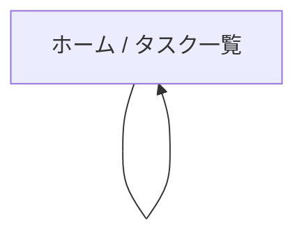

# UI/UX設計書 - タスク管理アプリ

## 1. デザインコンセプト

### 1.1 カラーパレット
- **プライマリ**: シンプルな青系（#3B82F6）
- **背景**: 白/グレー（ダークモード時はダークグレー）
- **テキスト**: 黒/濃いグレー

### 1.2 タイポグラフィ
- 見出し: システムフォント、太字
- 本文: 読みやすいサイズ（16px程度）

### 1.3 デザイン方針
- ミニマルで使いやすい
- 余白を適度に取る

---

## 2. 画面一覧と遷移

1ページ構成。タスクの追加・完了・削除は同一画面で行う。

---

## 3. 主要画面ワイヤーフレーム

### ホーム画面
- **ヘッダー**: 「タスク管理」タイトル
- **追加フォーム**: 入力欄 + 追加ボタン
- **タスクリスト**: 各タスクにチェックボックス + タイトル + 削除ボタン
- 完了済みタスクは取り消し線で表示
